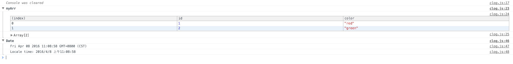

# clog
It's can print message depend on your param's type automatic in chrome console

##useage

clog is accept 3 params, the first param can be a array,object,date,number,element or string, the second param is the name of you defined.the third param is a bool, if it's true, all previous logs will be clear.


example:

```js
    var arr = [{
        id: 1,
        color: 'red'
    }, {
        id: 2,
        color: 'green'
    }]
    clog(arr, 'myArr', true);
    clog(new Date());
```


